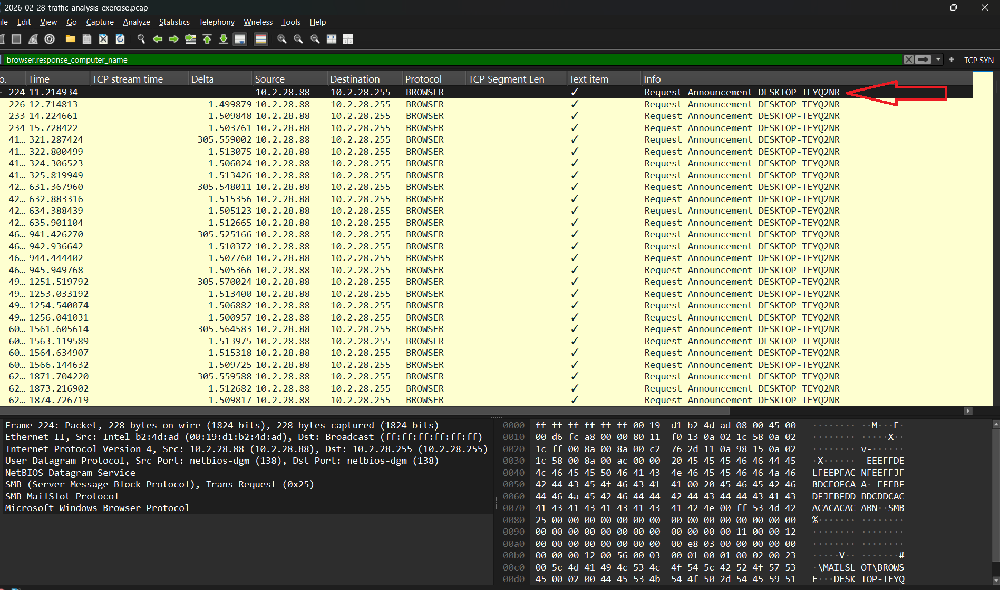
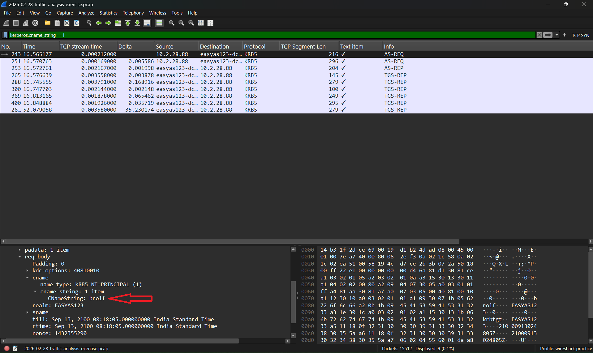
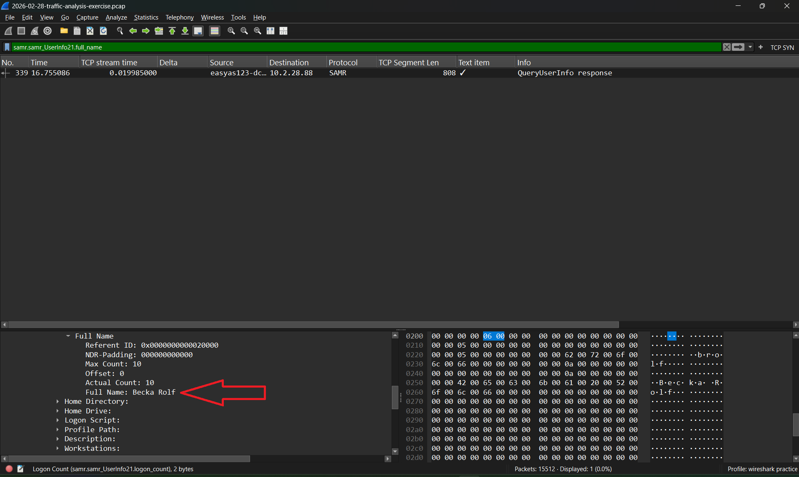

# wireshark-soc-network-investigation

Hands-on network traffic investigation using Wireshark and packet-level evidence.

## Project Overview

- **Tool:** Wireshark
- **Analysis Type:** Network Traffic Analysis
- **PCAP:** `2026-02-28-traffic-analysis-exercise.pcap`
- **PCAP Source:** Malware Traffic Analysis training exercise
- **Investigation Focus:** Host and user identification

## Investigation Objective

The objective of this investigation was to analyze the provided PCAP, identify a suspicious internal host based on its network activity, and determine additional information about the system and associated user.

The investigation was performed through packet-level analysis using Wireshark.

## 1. Identifying the Suspicious Host

The suspicious IP address was not directly assumed from the exercise.

I first examined the network traffic and used Wireshark's endpoint statistics to identify hosts generating significant network activity.

The endpoint analysis showed that:

`10.2.28.88`

was the host with the highest observed traffic volume in the capture.

Based on this observation, I selected `10.2.28.88` as the starting point for the investigation.


## 2. Identifying the MAC Address

After identifying `10.2.28.88` as the suspicious host, I investigated the Ethernet-level traffic associated with the host to determine its MAC address.

The packet details showed the following Ethernet source address:

`00:19:d1:b2:4d:ad`

This MAC address was associated with the suspicious host `10.2.28.88` in the captured traffic.


## 3. Identifying the Hostname

After identifying the suspicious host and its associated MAC address, I investigated the captured Windows Browser Protocol traffic to determine the hostname of the system.

I used the Wireshark display filter:

`browser.response_computer_name`

The captured traffic revealed the hostname:

`DESKTOP-TEYQ2NR`

This hostname was associated with the suspicious host `10.2.28.88`.



## 4. Identifying the Windows Username

After identifying the hostname, I investigated Kerberos authentication traffic to determine the Windows user account associated with the suspicious host.

I used the Wireshark display filter:

`kerberos.cname_string == 1`

The captured Kerberos traffic revealed the Windows username:

`brolf`

This username was associated with the suspicious host `10.2.28.88`.



## 5. Identifying the Full Name

After identifying the Windows username, I investigated SAMR traffic to determine the full name associated with the user account.

I used the Wireshark display filter:

`samr.samr_UserInfo21.full_name`

The captured SAMR response revealed the full name:

`Becka Rolf`

This information was associated with the previously identified Windows username `brolf`.



---

## 6. Investigation Evidence Chain

The investigation followed a step-by-step evidence chain, starting from network activity and progressively identifying information about the affected system and user.

```text
PCAP Traffic Analysis
        ↓
High-Traffic Endpoint Identified
        ↓
10.2.28.88
        ↓
MAC Address Identified
        ↓
00:19:d1:b2:4d:ad
        ↓
Hostname Identified
        ↓
DESKTOP-TEYQ2NR
        ↓
Kerberos Traffic Analysis
        ↓
User Account Identified
        ↓
brolf
        ↓
SAMR Traffic Analysis
        ↓
Full Name Identified
        ↓
        ↓
Becka Rolf
```

---

## 7. Investigation Findings

The investigation produced the following findings from the captured network traffic:

| Investigation Stage | Finding |
|---|---|
| Suspicious IP | `10.2.28.88` |
| MAC Address | `00:19:d1:b2:4d:ad` |
| Hostname | `DESKTOP-TEYQ2NR` |
| Windows Username | `brolf` |
| Full Name | `Becka Rolf` |

The suspicious host was identified by analyzing endpoint activity and selecting the host with the highest observed traffic volume.

The subsequent investigation used Ethernet, Windows Browser, Kerberos, and SAMR traffic to progressively identify the system and associated user information.

---

## 8. Skills Demonstrated

- Wireshark packet analysis
- Network traffic investigation
- Endpoint statistics analysis
- Identifying high-traffic network hosts
- IP address investigation
- MAC address identification
- Hostname identification
- Kerberos traffic analysis
- SAMR traffic analysis
- Wireshark display filters
- Host and user identification through network evidence
- Evidence-based security investigation

---

## 9. Tools Used

- **Wireshark** — Packet capture analysis and network traffic investigation
- **Malware Traffic Analysis** — Publicly available cybersecurity training PCAP

---

## 10. Disclaimer

This investigation was performed using a publicly provided training PCAP from a Malware Traffic Analysis exercise.

The captured traffic represents a training environment and was not captured from my own network.

The information presented in this repository is intended for educational and cybersecurity learning purposes.

---

## Conclusion

This investigation provided practical experience in analyzing network traffic and progressively identifying a suspicious host using packet-level evidence.

Instead of starting with a predefined IP address, I first examined endpoint activity and identified `10.2.28.88` based on its high observed traffic volume.

I then followed the available evidence through multiple protocols and Wireshark fields to identify the associated MAC address, hostname, Windows username, and full name.

This project helped me apply Wireshark beyond individual features and use it as part of a structured network investigation workflow.