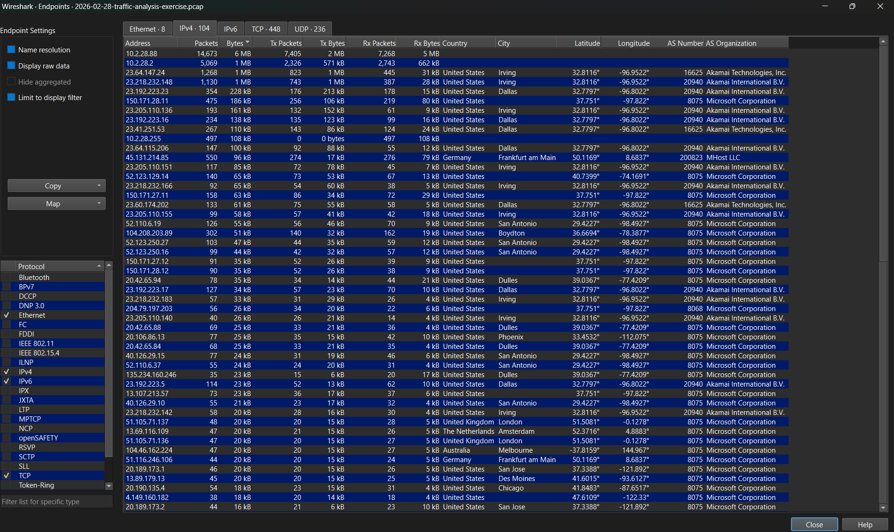
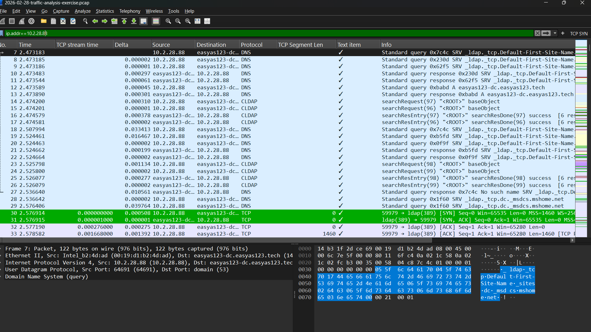

# wireshark-soc-network-investigation

Hands-on network traffic investigation using Wireshark and packet-level evidence.

## Project Overview

- **Tool:** Wireshark
- **Analysis Type:** Network Traffic Analysis
- **PCAP:** `2026-02-28-traffic-analysis-exercise.pcap`
- **PCAP Source:** Malware Traffic Analysis training exercise
- **Investigation Focus:** Host and user identification

## Investigation Objective

The objective of this investigation was to analyze the provided PCAP, identify a suspicious internal host based on its network activity, and determine additional information about the system and associated user.

The investigation was performed through packet-level analysis using Wireshark.

## 1. Identifying the Suspicious Host

The suspicious IP address was not directly assumed from the exercise.

I first examined the network traffic and used Wireshark's endpoint statistics to identify hosts generating significant network activity.

The endpoint analysis showed that:

`10.2.28.88`

was the host with the highest observed traffic volume in the capture.

Based on this observation, I selected `10.2.28.88` as the starting point for the investigation.

## 2. Identifying the MAC Address

After identifying `10.2.28.88` as the suspicious host, I investigated the Ethernet-level traffic associated with the host to determine its MAC address.

The packet details showed the following Ethernet source address:

`00:19:d1:b2:4d:ad`

This MAC address was associated with the suspicious host `10.2.28.88` in the captured traffic.

